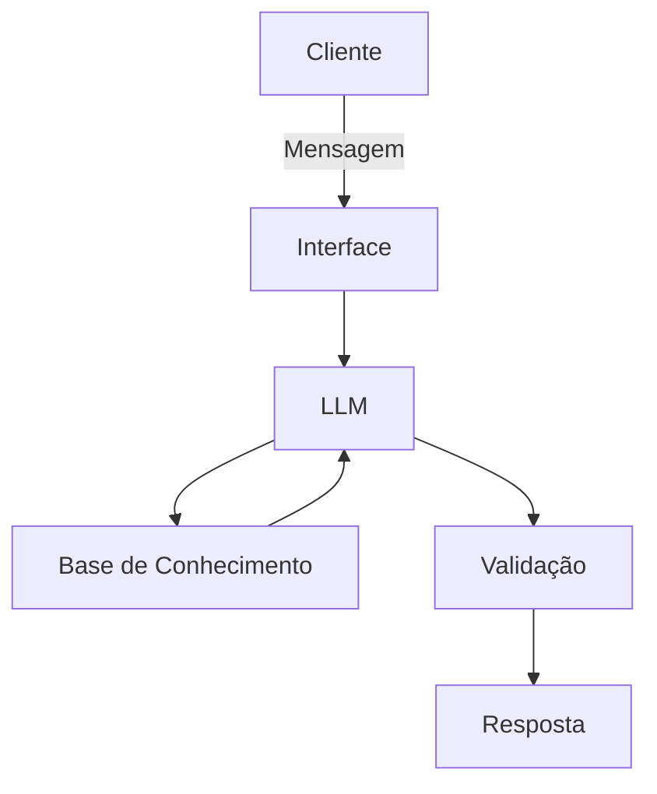

# Documentação do Agente

Aqui está pronto em formato **README.md** pra você subir direto no GitHub:

---

# 🤖 Yas - Assistente Financeira Inteligente

Projeto desenvolvido como desafio final do curso **GenAI & Dados da DIO**.

A **Yas** é um chatbot inspirado em assistentes bancários, criado para ajudar usuários a entender e organizar suas finanças de forma simples, rápida e acessível.

---

## 📌 Caso de Uso

### 💡 Problema

Muitas pessoas têm dificuldade em organizar suas finanças pessoais, entender seus gastos e tomar decisões financeiras no dia a dia. Além disso, o acesso a atendimento financeiro nem sempre é rápido ou claro.

### 🚀 Solução

A Yas atua como uma assistente financeira virtual que:

* Responde dúvidas financeiras
* Ajuda a organizar gastos
* Oferece orientações básicas
* Facilita o entendimento de informações financeiras

Tudo isso com linguagem simples e acessível.

### 🎯 Público-Alvo

* Jovens e estudantes
* Pessoas que querem organizar suas finanças
* Usuários com pouco conhecimento financeiro
* Quem busca atendimento rápido e digital

---

## 🧠 Persona e Tom de Voz

### 👩 Nome do Agente

**Yas**

### 💬 Personalidade

A Yas é:

* Amigável
* Prestativa
* Educativa
* Direta

Ela atua como uma assistente confiável que simplifica o mundo financeiro.

### 🗣️ Tom de Comunicação

* Acessível
* Levemente informal
* Claro e objetivo

### ✨ Exemplos de Linguagem

* **Saudação:**

  > "Oi! Eu sou a Yas 😊 Como posso te ajudar com suas finanças hoje?"

* **Confirmação:**

  > "Entendi! Já vou verificar isso pra você."

* **Erro/Limitação:**

  > "Ainda não tenho essa informação, mas posso te ajudar com outras dúvidas!"

---

## 🏗️ Arquitetura

### 🔄 Diagrama

### ⚙️ Componentes

| Componente           | Descrição                                 |
| -------------------- | ----------------------------------------- |
| Interface            | Chatbot em Streamlit |
| LLM                  | Ollama                        |
| Base de Conhecimento | JSON com dados financeiros simulados      |
| Validação            | Regras para evitar respostas incorretas   |

---

## 🔒 Segurança e Anti-Alucinação

### ✅ Estratégias

* O agente responde apenas com base nos dados disponíveis
* Informa quando não sabe algo
* Evita inventar informações financeiras
* Não faz recomendações sem contexto do usuário
* Respostas simples e verificáveis

### ⚠️ Limitações

A Yas **não**:

* Acessa contas bancárias reais
* Realiza transações financeiras
* Substitui um consultor financeiro
* Faz previsões de mercado
* Funciona sem dados fornecidos pelo usuário

---

## 📦 Tecnologias 

* Python + Streamlit
* API de LLM (Ollama)
* JSON para armazenamento de dados

---

## 📌 Status do Projeto

🚧 Em desenvolvimento

---

## 🤝 Contribuição

Sinta-se à vontade para contribuir com melhorias!

---

